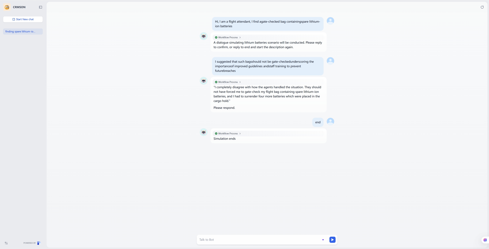
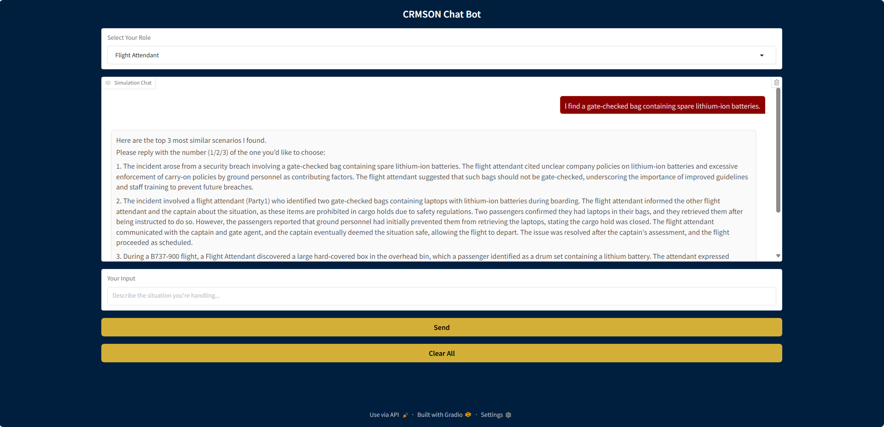

# CRMSON a multi-agent AI chatbot

CRMSON is a multi-agent AI chatbot designed to enhance team resilience in high-stakes environments such as aviation.

This repository will contain the core framework of the Chatbot AI system. 
## 🚀 Repository Structure

```plaintext
├── docs/                         # Documentation files
│   ├── label_datasets/                # Generate individual CSV files for each label
│   ├── label_datasets_with_roles/     # CSV files with split roles, cleaned unnecessary columns
│   ├── model_training_dataset/        # Training dataset used for fine-tuning LLM model
│   │          ├── converted_chat_messages .jsonl    # Cleaned and structured conversational format data                
│   │          └── groq_llama4_train2 .jsonl         # Raw training dataset generated by llama-4-scout-17b-16e-instruct
│   │
│   ├── persona/                       # Persona images and markdown
│   ├── Product_UI_display/            # Images about different versions of product UI and function display
│   ├── Wiki_documentation/            # Detailed project documentation including team collaboration records, project requirement analysis, design prototypes, task planning, and persona modeling
│   ├── attendant_data.csv             # Flight attendant data collected for Sprint 2
│   ├── event_objective_summary.csv    # Summarized narrative with labels
│   ├── filtered_passenger_data.csv    # Filtered aviation conflict data (passenger type related)
│   ├── groq_conception.docx           # Study of Groq platform functionality
│   └── role_split_clean.csv           # CSV files with split roles, cleaned unnecessary columns
├── finalpresentation/
│          └── Project_final_presentation.pptx     # Slides for client handover and demonstration
├── src/                               # Source code files
│   ├── demoweb/                       # Directory for frontend demo 
│   │      ├── api-key.env             # API key to access the backend (via Dify)
│   │      └── demo.py                 # Script for frontend UI design
│   ├── docker/                        # instruction How to Run the Dify on MRC AND how to Install Dify and Implement Workflow 
│   │      ├── CRMSON.V2.yml           # Pre-configured Dify Chatflow YAML for workflow import
│   │      └── README.MD               # Instruction on how to install Dify and run it on MRC (Melbourne Research Cloud)
│   ├── Summarized_narrative.ipynb     # Summarized narrative with labels
│   ├── data_split.ipynb               # Flight attendant data split into 18 labels
│   ├── dialogue_specific.ipynb        # Dialogue-specific CSV files creation
│   ├── model_fine_tuning_1.ipynb      # Jupyter notebook for training data preparation and LLM fine-tuning, includes detailed README instructions
│   └── role_split_clean.ipynb         # CSV file creation with split roles and cleaned unnecessary column 
└── README.md                      # GitHub structure description and sprint changelog
```

## Files Added in Sprint 4 (Final sprint)
- `finalpresentation/Project_final_presentation.pptx`  # Slides for client handover and demonstration
- `docs/Wiki_documentation/Handover.md`  # include  Final ZIP Package for the Client
- `src/docker/CRMSON.V2.yml`     # Pre-configured Dify Chatflow YAML for workflow import


## Files Updated in Sprint 4 (Final sprint)
- `docs/Wiki_documentation/Demonstration-Video.md` # update final demonstration video (handover)
- `docs/Wiki_documentation/Home.md`
- `docs/Wiki_documentation/Meeting-Notes.md` # update the meeting notes from sprint 4
- `docs/Wiki_documentation/Usage.md` # update How to Install Dify and Implement Workflow 
- `docs/Wiki_documentation/_sidebar.md`
- `src/docker/README.md`  # Instruction on how to install Dify and run it on MRC (Melbourne Research Cloud)


## Files Added in Sprint 3
- `docs/model_training_dataset/converted_chat_messages .jsonl `
- `docs/model_training_dataset/groq_llama4_train2 .jsonl`
- `src/model_fine_tuning_1.ipynb` # Jupyter notebook for training data preparation and LLM fine-tuning, includes detailed README instructions
- `docker/`   # dify depolyment on cloud (MRC)
- `src/demoweb/api-key.env`
- `src/demoweb/demo.py` # Script for frontend UI design
- `docs/Wiki_documentation/Cyber-Security.md`
- `docs/Wiki_documentation/Ethical-Considerations.md`
- `docs/Wiki_documentation/Demonstration-Video.md`
- `docs/Wiki_documentation/Testing.md` # Document Backend Testing
- `docs/Wiki_documentation/Usage.md` # Document How to Run the System

## Files Updated in Sprint 3
- `docs/Wiki_documentation/Code-Review.md` # update code review in sprint 3
- `docs/Wiki_documentation/Sprint-Planning-Review-and-Retrospective.md` # update Sprint 3 review and Sprint 4 planning
- `docs/Wiki_documentation/Meeting-Notes.md` # update meeting note in Sprint 3
- `docs/Wiki_documentation/Client-Feedback-and-Features.md`
- `docs/Wiki_documentation/Project-Overview.md` # move demo video from project overview to Demonstration video


## Files Added in Sprint 2
- `docs/label_datasets/`
- `docs/label_datasets_with_roles/`
- `docs/attendant_data.csv`  
- `docs/event_objective_summary.csv`    
- `docs/groq_conception.docx`  
- `docs/Product_UI_display/` (new folder for product interface screenshots)  
- `docs/Wiki_documentation/` (new folder for detailed project documentation)
- `docs/role_split_clean.csv`
- `src/Summarized_narrative.ipynb`
- `src/data_split.ipynb`
- `src/dialogue_specific.ipynb`
- `src/role_split_clean.ipynb`

These files and folders were created or significantly updated during Sprint 2 to support data processing and help model deployment.

## 🎯 Changelog

### Sprint 1 Updates
* The goal of the project was clarified - to design an AI chatbot to simulate aviation conflict scenarios to help different crew members solve problems.
* Clarified the technology stack to be used -  Using open-source large models (such as Qwen2VL, LLaVA) locally and using lightweight computing devices (such as our own laptop or computer) for inference.
* Four personas were designed based on various cases from the aviation conflict database：
   * Maintenance Technician (Michael Thompson)
   * Flight Attendant (Olivia Carter）
   * Commercial Airline Captain(James Walker)
   * Cabin Crew Lead (Noah Jensen)
* Designed 4 user stories based on the personas’ needs :
  * US1 - Enhancing Maintenance Accuracy through Scenario Simulation
  * US2 - Handling Passenger Misconduct with Professionalism
  * US3 - Resolving NOTOC-Closeout Conflicts Before Takeoff
  * US4 - Simulating In-Flight Medical Emergency Coordination

* User Story 2 Decomposition for spring 2


### Spring 2 Updates
* Reflection of feedback from sprint 1 
  * In the task board 
    * Add missing tasks
    * Add descriptions and story points to all tasks
    * Add reviews of completed tasks
    * Link tasks to relevant user stories
  * Improve branch naming convention
  * Add wiki document into docs/
  * Pay more attention to client feedback in sprint 2 video

* Major updates in sprint 2
  * **LLM Selection**
    *  Using **LLaMA-3** for Text analysis
    *  Using **QWEN-embedding** for case retrieval
  * **Platform Choice for Model Deployment** - **dify workflow**
    * Research on groq platform functions
    * Research on deployment model of dify platform
  * **Data Preprocessing**
    * **Data Filtering** - Based on persona #2 Flight Attendant Olivia Carter, all data related to flight attendants were filtered out from the aviation conflict dataset.
    * **Data Classification** - Use the deepseek model to summarize the process of each aviation conflict and classify them into different labels based on similar event_objective_summary
  * **Core Product Functionality Completed**
    * US2.10 Initial Application Entry Point - Used the default UI of the Dify platform for input, we will develop our own featured UI in future sprints
    * US2.1 Input Conflict Scenario - **LLaMA-3** was implemented to analyze the key information in the user input
    * US2.3 Retrieve Similar Case Suggestions - Used **QWEN-embedding** to search for the closest scenarios
    * US2.5 Multi-turn Conversation Simulation - The conversation will continue until the user prompts the chatbot to stop
  * Product v1 interface and function display
  


### Spring 3 Updates
* Reflection of feedback from sprint 2
  * Issue 1: The title format in the Meeting section is not consistent.
  * Improvement measures: Fixed some subtitle errors 
  * Issue 2: The Sprint 2 Demo video is hidden in the Project Overview and is not easy to find.
  * Improvement measures:Added a dedicated "Demonstration Video" page to the Wiki.
  * Issue 3: All code reviews are self-reviews, with no evidence of involvement by others.
  * Improvement measures: On every Pull Request, assign Reviewers to ensure that they leave a review comment.


* Major updates in sprint 3
  * **Ethical and Cyber Security Considerations**
    * Completed comprehensive documentation on cyber security, including secure coding practices, authentication, and third-party integration measures.
    * Added detailed ethical considerations, outlining privacy, transparency, inclusivity, and sustainability principles, along with identified ethical risks and mitigation strategies.
  * **Model fine-tuning**
    * Generate a raw model training dataset according to the `objective summary` in `role split clean.csv` through **llama-4-scout-17b-16e-instruct**
    * Using **Qwen-3-8B** and LoRA (Low-Rank Adaptation) to efficiently fine-tune large model

  * **Retrieval logic update**
    * Updated retrieval logic from a fixed 18-document list to a full semantic knowledge base.
  * **Backend depolyment**
    * Deployed the backend from local to MRC
  * **Frontend and Backend Integration**
    * Developed and deployed a user-friendly Gradio-based frontend, now fully connected to the backend hosted on MRC.
  * **Rest Product Functionality Completed**
    * US2.10 Initial Application Entry Point -Designed a UI using Gradio that allows for scenario input and role selection.
    * US2.2  Select the role in simulation -Implemented a dedicated role selection button in the Gradio UI, allowing users to confirm the roles of both participants before the simulation begins.
    * US2.3  Retrieve Similar Case Suggestions - In Sprint 2, the model could return one closest scenario. In Sprint 3, the model can return the top three most similar scenarios for users to choose from.
    * US2.4  Choose to view case or skip     - After scenario input, the model returns the top 3 related scenarios. Users can select one preferred scenario to start the simulation.
    * US2.6  Vary emotional tone of passenger - Before simulating the scenario, users can now select the tone intensity of the speaking role.
    * US2.7  Restart simulation with new strategy - Allow users to repeat the same scenario by changing the chatbot’s tone and role.
  * Product v2 interface and function display
  


### Spring 4 Updates (Final Sprint)
* Major updates in sprint 4
  * **update the instruction about How to Install Dify and Implement Workflow** 
      * Dify installation
      * Workflow implementation
      * Model selection
      * Knowledge base Setup
      * Integrating New Data into the Chatflow for Scalability
  * **final handover demonstration video**
    * Includes recorded demo ( ~ 5 min)  
    * Covers walkthrough of CRMSON usage and configuration 

 ### Final Handover

* **Product Deliverables**
  - **CRMSON Web Application (v2)**
    - Deployed on a virtual machine via Dify workflow  
    - Core functionality completed and accessible via public URL

* **Implemented Features**
  - Input Conflict Scenario  
  - Retrieve Similar Case Suggestions  
  - Multi-turn Conversation Simulation  
  - Role Selection  
  - Tone customization and user-controlled conversation end
  

* **Documentation**

  - `README.md` with full project overview, system structure, and changelog  
  - Persona generation 
  - Data cleaning instruction  
  - Model fine-tuning instruction  
  - Frontend design (gradio)
  - Deployment instructions for backend (Dify) 
  - Final Presentation
  - Source code
  - Wiki pages detailing:
    - Personas & user stories  
    - Use case mapping  
    - Client Feedback and Features  
    - Code Review  
    - Ethical Considerations
    - Meeting Notes
    - Sprint-Planning-Review-and-Retrospective
    - Handover
    - Cyber Security

* **Client Training**
  - Deliver a short 5 min handover demo to the client  
    *(recorded video + live Q&A)*
   
   


## 📄 Wiki
* For more details about this repository, please refer to the [wiki](https://github.com/FEIT-COMP90082-2025-SM1/IN-BlueRing/wiki) pages.
## ✈️ Prototype
* [Prototype](https://github.com/FEIT-COMP90082-2025-SM1/IN-BlueRing/wiki/prototype) of CRMSON.
## 🎞 Demonstration
* [Demo](https://github.com/FEIT-COMP90082-2025-SM1/IN-BlueRing/wiki/Demonstration-Video) of CRMSON. 
## 💯 Usage Guidelines
* How to [Use](https://github.com/FEIT-COMP90082-2025-SM1/IN-BlueRing/wiki/Usage).
## 📫  Have a question? Feedback?
* We are happy to welcome you in leaving your questions via GitHub Discussions! 


